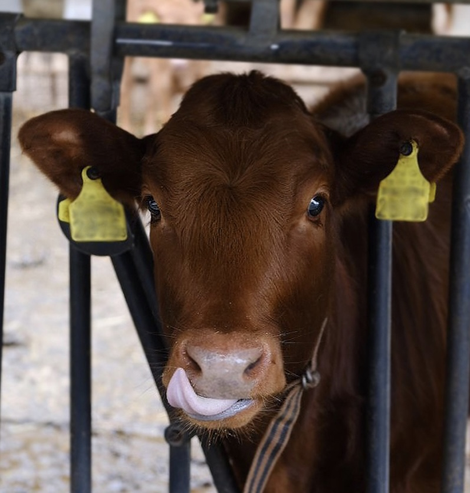
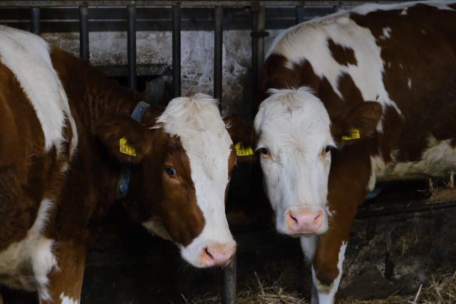
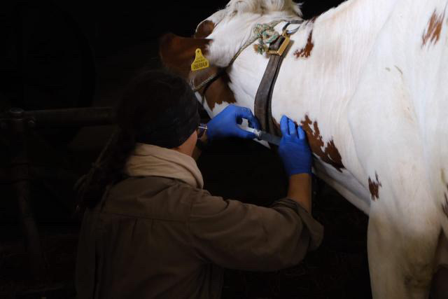

+++
title = "  Arbeitstag als Grosstierarzt: Mit grossen Tieren kommt grosse Verantwortung: Ein wichtiger Teil der Schweizer Infrastruktur, der oft unterschätzt wird. Was macht ein Grosstierarzt?"
date = "2023-06-28"
draft = false
pinned = false
tags = ["blog", "liloblog", "stanlemondemon", "somebodypleasesaveme", "Reportage", "deutsch"]
image = "img_4498.jpeg"
footnotes = "Tamara Dudko & Helena Kohler"
+++

 **Anfang unseres Abenteuer** 

Um acht Uhr morgens, am ersten Mai, beginnt unser Abendteuer mit der Ankunft in der Tierarztpraxis Sägematt in Belp. Das Wetter ist düster und regnerisch, was unsere muntere Laune und Aufregung nicht trüben kann. Als erstes werden wir an der Rezeption begrüsst und gebeten, kurz im Wartezimmer Platz zu nehmen, während eine Assistentin unsere Ansprechspartnerinnen, die Tierärztinnen Carmen Sautter und Susanne Marti, holt. Obschon es ein Montagmorgen ist, ist in der Tierarztpraxis schon viel los: mehrere junge Pärchen sitzen mit Katze oder Hund im Wartezimmer, während sich die Tierärzte auf die ersten Patienten vorbereiten. 

Unsere Ärztinnen sind auf die Behandlung grosser Nutztiere direkt auf den Bauernhöfen spezialisiert. Tamara und ich dürfen sie auf Hofbesuchen begleiten und werden zu den Praxisautos geführt. Es sind grosse, komforable Autos, welche nebst den beiden Vordersitzen randvoll mit Medikamenten und anderen essenziellen Werkzeugen zur Behandlung von Grosstieren beladen ist. 

Susannes Stimmung ist alles andere als gelassen, da wir offenbar einen unvorhersehbar hektischen Tag für unseren Besuch geroffen haben. Susanne und ich machen uns auf den Weg zum ersten Einsatz auf dem Belpberg. 

 

**Was macht ein Grosstierarzt?**

 

Auf ihrem Weg zum ersten Einsatz erklärt Carmen Tamara im Detail, was ein Grosstierarzt genau macht. 

Grosstierärzte in der Schweiz kümmern sich um die Gesundheit und das Wohlergehen von Kühen, Pferden und Schafen. Unter einem Grosstier versteht man ein Tier, welches eine wichtige Rolle in der Ökonomie spielt und meist der Nahrungsmittelproduktion dient.

Heutzutage sind die meisten Tierärzte auf bestimmte Tierarten spezialisiert. Früher war es noch eher der Fall, dass sich ein Tierarzt um alle Tierarten kümmerte, heute haben sich die Anforderung und Erwartungen jedoch geändert. 

 

Eingriffe sind oft Check-ups zur Fruchtbarkeit oder Gesundheit eines Tieres, Diagnosen und Behandlungen bei Unfällen und Krankheiten.

Ihre Arbeit spielt nicht nur für das Tier eine wichtige Rolle, sondern auch für die Landwirtschaft. Grosstierärzte arbeiten eng mit Bauern zusammen und stellen damit sicher, dass die Grosstiere weiterhin qualitativhochwertige Produkte unter humanen Umständen produzieren können. 

 

**Was sind die Vorteile und Nachteile am Beruf?**

 

Wir fragen Carmen und Susanne im Verlauf des Tages nach den besten Aspekten des Berufes.

Beide lieben die Arbeit im Freien und den direkten Kontakt zur Natur. Auch die Verbindung zur Produktion von Lebensmitteln, die sie selber konsumieren, erwähnen die Beiden. Sie sind sich einig,einen sehr sinnlichen und naturverbundenen Beruf aus zu üben, bei dem sie den Eindruck haben, etwas Wichtiges zu tun. 

 

Nach dem Gegenteil, den unangenehmsten Aspekten ihres Berufs gefragt, nennen beide die unregelmässigen Arbeitszeiten und die Ungewissheit, wieviel Schlaf sie in einer Nacht bekommen werden.

Da man nie voraussehen kann, wann etwas passiert, bieten die meisten Grosstierpraxen einen Notdienst an, bei welchem es auch oft Nachteinsätzen kommt.

Verglichen mit andren Sparten im gleichen Beruf verdienen Grosstierärzte tendenziell weniger, was vielleicht mit dem unterschiedlichen Stellenwert von Haustieren und Nutztieren in der Gesellschaft zu tun hat. Viele Haustierhalter würden viel Geld ausgeben zur Behandlung ihres Tieres, während man sich bei Grosstieren viel eher noch überlegt, ob ein Eingriff sich wirklich lohnt.

 

**Typische Einsätze**

 

Der erste Einsatz, bei dem ich Susanne begleiten darf, ist ein Typischer: Amandora leidet an einer Euterinfektion. In einem Stall kommt es oft zu Infektionen, die Kühe verletzen sich selbst, oder ihre Umgebung ist nicht hygienisch genug. 

Aufgrund einer Euterinfektion kann die Kuh fast keine trinkbare Milch mehr produzieren. Dies ist nicht nur schlecht für den Bauern, sondern auch für die Kuh, da es zu einer schmerzhaften und riskanten Schwellung des Euters führt. 

Susanne macht einen Milchtest und weiss schnell, was zu tun ist. Sie verabreicht der Kuh eine Spritze mit Antibiotikum und Schmerzmitteln. Amandora ist wenig begeistert von der Injektion und drückt Susanne gegen ein Gitter, um sie ausser Gefecht zu setzen. Obwohl Amandora trotz ihrer Erkrankung eine starke Kämpferin ist, kann Susanne ihre Untersuchungen nach kurzer Zeit fortsetzen. Susanne gibt dem Bauer Spritzen und Anweisungen zur Weiterbehandlung mit und wir verabscheiden uns von Amandora und ihm.

 

Der nächste Einsatz führt uns auf einen kleinen Bauernhof, nur wenige Minuten vom ersten entfernt. Wir sind hier für einen weiteren typischen Einsatz, einen Fruchtbarkeitstest bei einer Kuh. Für diese Untersuchung muss Susanne ihren Arm in die Scheide der Kuh einführen und nach der Gebärmutter greifen. Normalerweise ist dies ein einfacher und problemloser Eingriff, jedoch ist Felizia eher klei und überfüttert, was die Einführung erschwert. Ich hatte mich mental vorbereitet, bin jedoch nicht bereit für das viele Blut. Der Geruch des frischen Kuhbluts löst bei mir eine starke Übelkeit aus und ehe ich mich versehe, liege ich bewusstlos am Boden, einzig und allein Kuhmist dämpft meinen Fall. Nach ein paar Minuten Erholung und einer Dose Cola geht es mir zum Glück bald wieder besser, und wir brechen auf.

 

**Schlachten und Einschläfern**

 

Von den 1,5 Millionen Kühen, die in der Schweiz leben, finden die meisten ihren Tod auf dem Schlachthof. Wenn eine Kuh verletzt ist, zu alt wird, nicht mehr effizient Milch produzieren kann und nicht zu krank ist für den sicheren Verzehr, wird eine Kuh geschlachtet. In der Schweiz gibt es strenge Regeln zur Schlachtung von Tieren, daher gibt es auch Fälle, in denen eine Kuh per Anästhesie eingeschläfert werden muss.

 

Der letzte Fall vom Vormittag ist leider auch einer, in dem sich der Bauer schlussendlich entscheiden muss, ob er seine Kuh einschläfern will. 

In der Nacht ist Lady auf ihre eigene Zitze gestanden und riss sie ab. 

Eine Kuh kann gemetzgert werden, so lange sie einigermassen gesund und weniger als drei Monate schwanger ist. Leider ist Lady schon im vierten Monat, was bedeutet, dass sie eingeschläfert werden müsste. Die Kosten für eine Zitzenamputation sind sehr hoch, da Operationen bei Kühen generell anspruchsvoll sind. Aus diesem Grund entschliesst sich der Bauer für die Anästhesie, beschwerte sich jedoch über deren Preis von 40.-.

 

**Ausbildung** 

 

In der Mittagspause treffen Tamara und ich uns wieder in der Praxis, wo uns Susanne und eine weitere Tierärztin, Alice Kaiser, über den Ausbildungweg zum Grosstierarzt in der Schweiz informieren.

In der Schweiz gibt es nur eine Ausbildung in Richtung Veterinärmedizin, nach welcher man entweder mit Kleintieren, Grosstieren oder im Labor arbeiten kann. 

Nach der Matura oder Berufsmatura gibt es einen 5-Jährigen Studiengang, der aus einem dreijährigen Bachelor- und einem zweijährigen Master-Teil besteht. 

Im Bachelor-Studium werden grundlegende Kenntnisse in den Bereichen Anatomie, Immunbiologie, Mikrobiologie und Physiologie erlernt. Im Master-Studium werden vor allem Diagnostik, Umgang mit Grosstieren und Therapie vertieft. Da die Berufe der Veterinärmedizin sehr praxisorientiert sind, machen Studierende auch oft Praktiken in Tierarztpraxen, bei welchen sie lernen, an echten Tieren zu operieren und mit ihnen umzugehen.  

Am Ende der Ausbildung absolvieren die Studenten eine staatliche Prüfung und entscheIden im Verlauf des Berufslebens, welche Richtung sie einschlagen werden.

 

Nach diesem Einblick in den Berufsalltag sind wir zutiefst beeindruckt und voller Respekt für Susanne und Carmen. Der Umgang mit den Nutztieren hinterlässt bei uns einen tiefen, zwispältigen Eindruck. 

 

**Fliesstext über die Tierarztpraxis Sägematt AG und die Personnen die diese Reportage ermöglicht haben**

Die Tierarztpraxis Sägematt besteht aus zehn hartarbeitenden und ehrgeizigen Tierärztinnen die jederzeit bereit sind einem Tier in Not zu helfen. Die Praxis behandelt Kleintiere, Grosstiere, führt ein Labor und rührt auch spezialbehandlungen wie künstliche Besammung durch. Sie führen einen Notfall- und Nachtdienst, bei welchem sie 24 Stunden am Tag und 365 Tage im Jahr erreichbar und bereit zu handeln sind. Susanne Marti, mit welcher ich den Vormittag verbracht habe, studierte 1996 - 2001 Veretinärmedizin in der Universität Bern und fing im Jahr 2008 an in der Tierarztpraxis Sägematt zu arbeiten, wo sie seit 2016 Teilhaberin ist. 

Alice Kaiser, mit welcher wir unseren Besuch organisiert haben, studierte von 2002 – 2007 Veterinärmedizin an der Universität Bern. Sie arbeitet schom seit 2008 in der Tierarztpraxis Sägematt und ist seit 2016 auch Teilhaberin der Praxis. 

Die Tierärztin Carmen Sautter studierte 2007 - 2014 Veterinärmedizin an der Tierärztlichen Hochschule Hannover und seit 2022 arbeitet sie für die Toerarztpraxis Sägematt

 

**Ausschnitt aus dem Interview mit Carmen Sautter**

***Carmen: Der beste Aspekt am Beruf also Grosstierarzt, dass man draussen ist, dass man die ganze Zeit draussen an der Natur ist, dass man mit Lebensmitteln zutun hat letztenendes. Also die Tiere die wir behandeln, das ist nachher was wir essen, die produzieren die Milch die wir trinken. Das finde ich, gibt dem ganzen enorm viel Sinn und Bedeutung und das Schönste ist das Kalbern, wenn man mit einer Geburt mit dabei hilft. #00:00:39#***

***(...)***

***Tamara: Vielen Dank und was ist ihrer Meinung nach der schlechteste Aspekt am Beruf? #00:00:45#***

***Carmen: Teilweisse die unvorhersehbaren Arbeitszeiten und grad bei den Grosstieren, bietet eigentlich auch jede Praxis Notdienst-Nachtdienst an und man weiss einfach nicht wie viel Schlaf man bekommt und weiss nicht wann der Tag ended. Es ist nicht so geplannt wie bei den Kleintieren meistens, wo es deutlich planbarer ist. #00:01:14#***

***Tamara: Danke, wieso haben Sie sich für diesen Beruf entschieden? #00:01:20#***

***Carmen: (überlegt für eine Weile) Ich kann gut mit Tieren (lacht) und ich hab eine Zeit lang auch Forschung gemacht und das biete einem beide Möglichkeiten. Man kann im Labor arbeiten und forschen, wenn man Tiermedizin studiert hat und man kann in der Praxis arbeiten. Ich hab schon immer gut Tiere glaub ich verstanden, ob ihnen was fehlt oder nicht. Das war relativ natürlich. #00:01:47#***

***Tamara: Okay, hat sich die Ausbildung für sie gelohnt? #00:01:53#***

***Carmen: In wie fern? (lacht) Man lernt viel, es ist ein spannender Beruf, man verdient sehr wenig im Vergleich zu anderen, die gleich lange studieren, die Arbeitszeiten sind mit unterfurchtbar. Das sind Dinge die manchen den Job verleiden und gleichzeitig kann er einem enorm viel geben. Ja, was soll ich sagen? Ein Plus und ein Minus. Ich hätte es wieder studiert, denk ich. Also Geld haben; so lange man genug hat, ist eigentlich alles in Ordnung. #00:02:37#***

***Tamara: Und wenn sie irgendeinen anderen Beruf wählen könnten, was wäre es? #00:02:44#***

***Carmen: Ich würde immernoch Tiermedizin machen, aber in die Forschung gehen, also im Labor. #00:02:53#***

 

 

